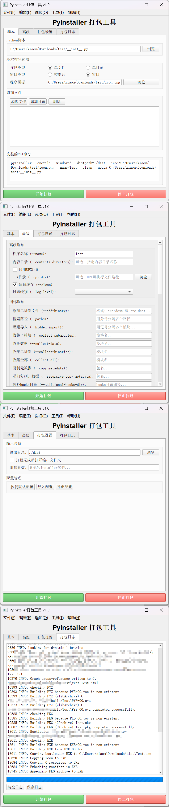

# PyInstaller打包工具

这是一个基于PyQt5开发的PyInstaller图形化打包工具，旨在简化Python程序的打包过程，提供直观易用的界面。

## 软件截图



---

## 常见问题

### Q 能否打包成独立的exe打包工具

**暂定**

### Q 这样有什么优势？打包后的文件变小了吗？

**没有优势**

**关于文件大小**

- 本工具本身不会使文件变小，文件大小主要取决于PyInstaller的打包机制

### Q 是否方便打包了？

- **并没有**，只是提供了直观易用的界面和可视化的操作

---

## 功能特性

### 基本功能

- **脚本选择**: 支持浏览选择Python脚本文件
- **打包类型**: 支持单文件和单目录两种打包模式
- **窗口类型**: 支持控制台和窗口两种应用类型
- **图标设置**: 支持为打包后的程序设置自定义图标
- **附加文件**: 支持添加额外的文件和目录到打包中
- **实时预览**: 实时显示生成的PyInstaller命令

### 高级功能(待实现)

- **UPX压缩**: 支持启用UPX压缩减小文件体积
- **隐藏导入**: 支持手动指定隐藏导入的模块
- **模块排除**: 支持排除不需要的模块

### 模块功能

- **模块检测**: 支持自动识别所需模块并显示
- **模块配置**: 支持手动/自动配置

### 打包设置

- **输出目录**: 自定义打包输出目录
- **附加参数**: 支持添加自定义PyInstaller参数
- **打开目录**: 支持打包完成后并打开输出目录
- **配置管理**: 支持导入导出打包配置

### 打包日志

- **实时日志**: 实时显示打包过程和输出
- **进度显示**: 显示打包进度
- **日志管理**: 支持清空和保存日志

---

## 安装要求

### 依赖库

```bash
pip install PyQt5
pip install pyinstaller
```

### 可选依赖

- **UPX**: 用于压缩可执行文件(需要单独下载安装)

## 使用方法

### 1. 启动程序

```bash
python __init__.py
```

### 2. 基本使用步骤

#### 步骤1: 选择Python脚本

1. 在"基本"选项卡中点击"浏览"按钮
2. 选择要打包的Python脚本文件(.py)

#### 步骤2: 配置打包选项

1. **打包类型**: 选择"单文件"或"单目录"
2. **窗口类型**: 选择"控制台"或"窗口"
3. **程序图标**: 可选择.ico或.png格式的图标文件

#### 步骤3: 添加附加文件(可选)

1. 点击"添加文件"按钮添加单个文件
2. 点击"添加目录"按钮添加整个目录
3. 选中项目后点击"删除"按钮可移除

#### 步骤4: 高级设置(可选)

1. 切换到"高级"选项卡
2. 根据需要启用UPX压缩
3. 设置隐藏导入模块
4. ...

#### 步骤5: 打包设置

1. 切换到"打包设置"选项卡
2. 设置输出目录(默认为./dist)
3. 选择"打包完成后打开输出文件夹"(默认选中)
4. 添加附加参数(如果需要)

#### 步骤6: 开始打包

1. 点击"开始打包"按钮
2. 程序会自动切换到"打包日志"选项卡
3. 实时查看打包过程和结果

### 3. 菜单功能

#### 文件菜单(待实现)

- **新建项目**: 创建新的打包项目
- **打开项目**: 打开已保存的项目配置
- **保存项目**: 保存当前项目配置
- **退出**: 退出程序

#### 编辑菜单

- **清空配置**: 清空所有配置项

#### 选项菜单(待实现)

- **设置**: 打开程序设置对话框

#### 工具菜单

- **检查PyInstaller**: 检查PyInstaller是否正确安装
- **安装PyInstaller**: 安装PyInstaller
- **检测所需模块**: 检查脚本文件所需模块

#### 帮助菜单

- **捐赠**: 打开捐赠页面
- **联系**: 打开联系页面
- **首页**: 打开项目首页
- **关于**: 显示关于对话框

## 项目结构

```     
PyInstallerPacker/
│
├── README.md               # 说明文档
├── __init__.py             # 主程序文件
├── about_dialog.py         # 关于对话框
├── icon.png                # 图标
├── requirements.txt        # 依赖文件
└── ...
```

## TODO

- [🔲 指定python环境(python虚拟环境)打包](https://www.52pojie.cn/forum.php?mod=redirect&goto=findpost&ptid=2041034&pid=53305297)

## 版本历史

### v1.0.1

**更新[UPDATE]**

1. [✅ 打包时，若没有PyInstaller，就自动安装。](https://www.52pojie.cn/forum.php?mod=redirect&goto=findpost&ptid=2041034&pid=53302030)
2. [✅ 打包时自动识别出所需的模块，同时显示所需的模块路径。进行手动或者自动配置到项目中。](https://github.com/xuyouer/xuyou-pyinstaller-gui/issues/1#issue-3169918757)

### v1.0.0

- 基本打包功能
- 图形化界面
- 实时日志显示
- 配置管理基础框架

## 开发者信息

- **作者**: [xuyou](https://github.com/xuyouer/) & [xiaomizha](https://github.com/xuyouer/)
- **开发语言**: [Python](https://www.python.org/)
- **GUI框架**: [PyQt5](https://www.riverbankcomputing.com/software/pyqt/)
- **许可证**: [MIT License](https://github.com/xuyouer/xuyou-pyinstaller-gui/blob/main/LICENSE)

## 贡献

欢迎提交[Issue](https://github.com/xuyouer/xuyou-pyinstaller-gui/issues)
和[Pull Request](https://github.com/xuyouer/xuyou-pyinstaller-gui/pulls)来帮助改进这个工具。

## 许可证

本项目采用MIT许可证 - 详见[LICENSE](https://github.com/xuyouer/xuyou-pyinstaller-gui/blob/main/LICENSE)文件。