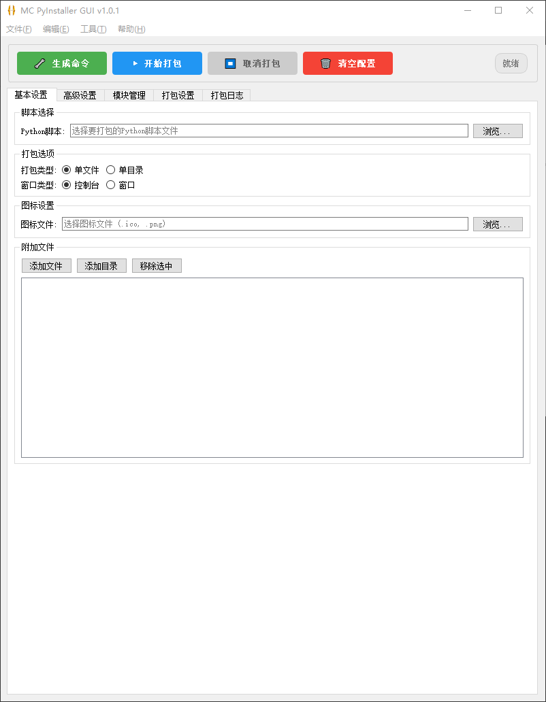
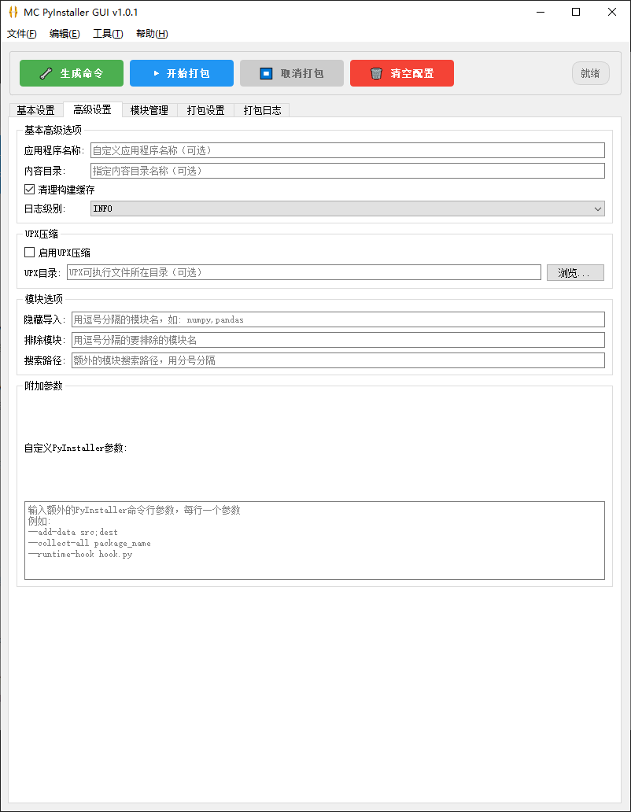
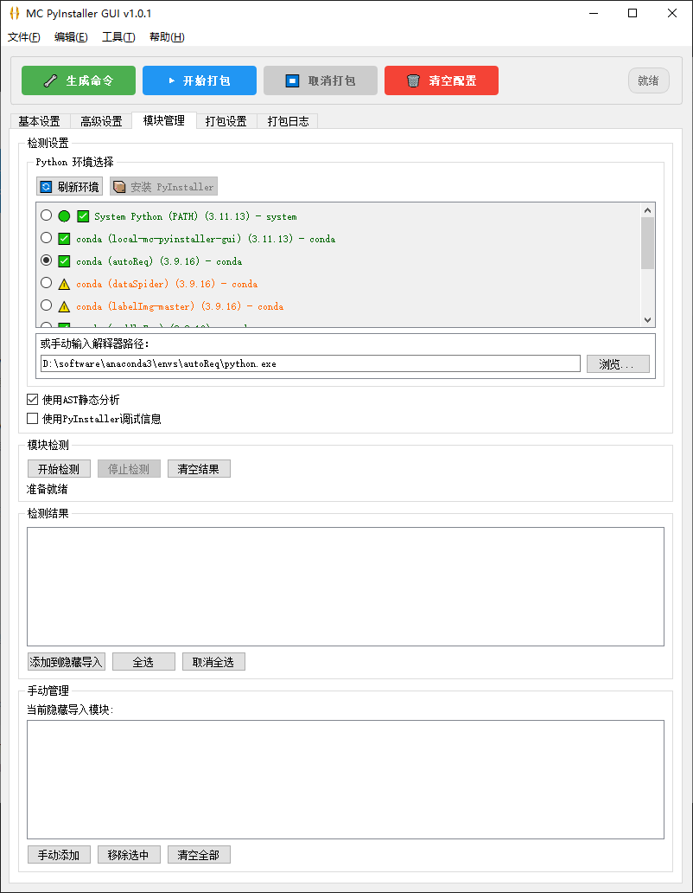
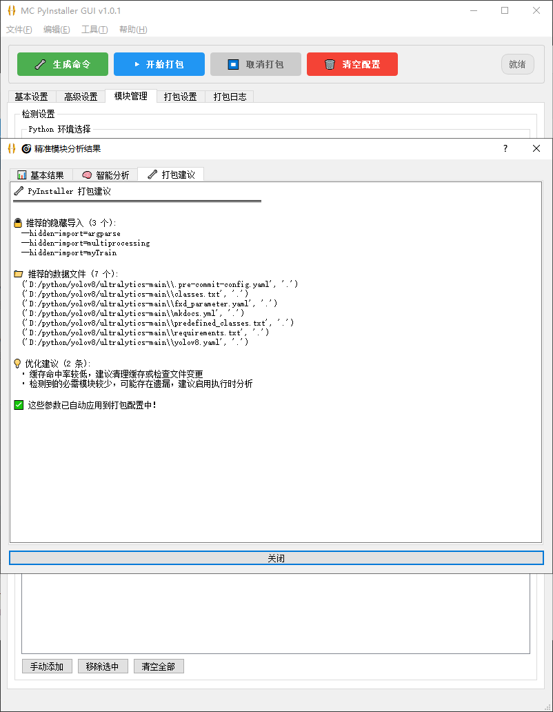
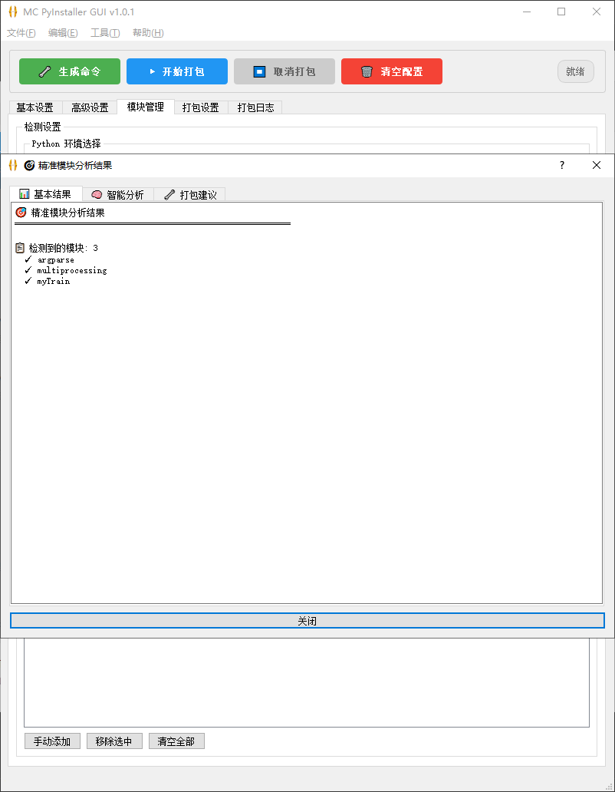
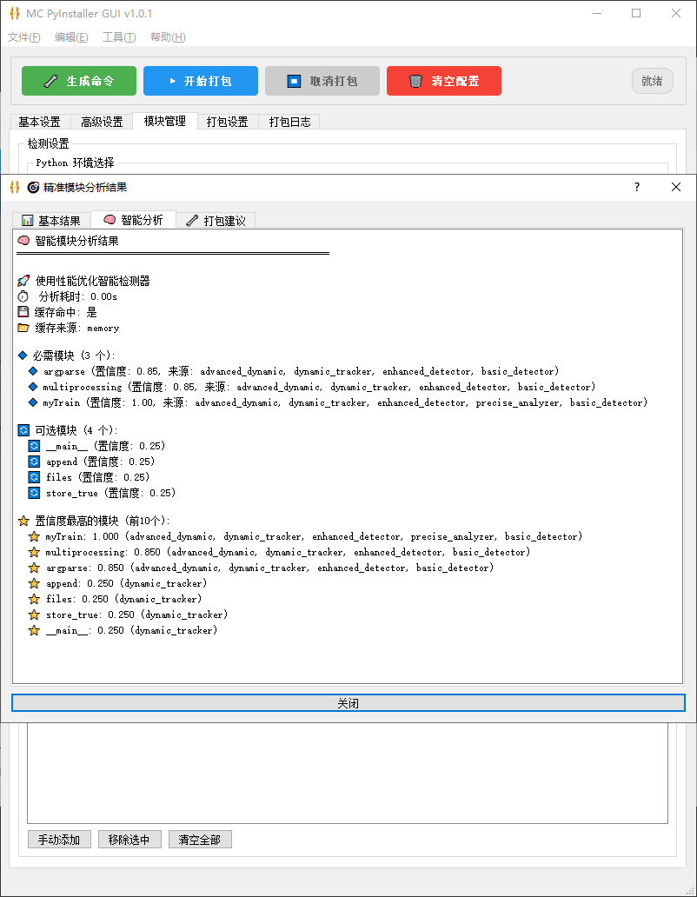
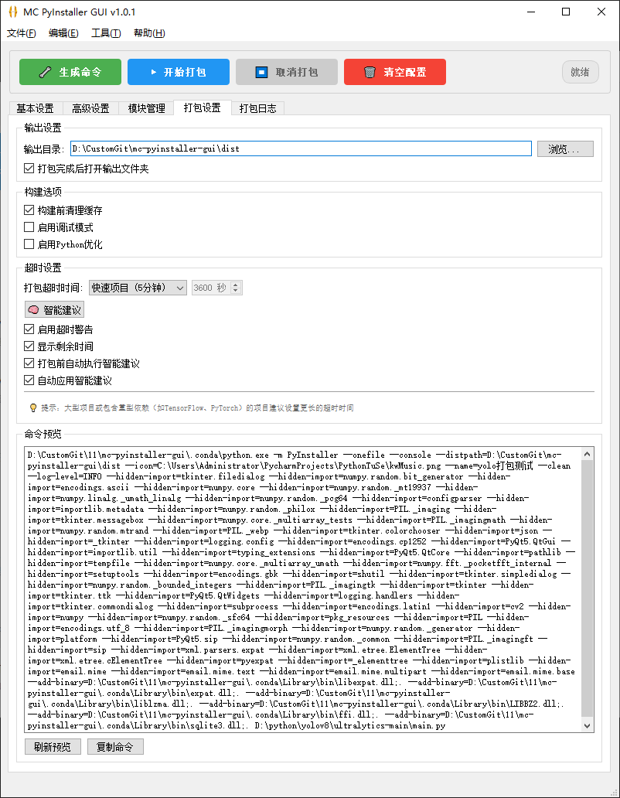
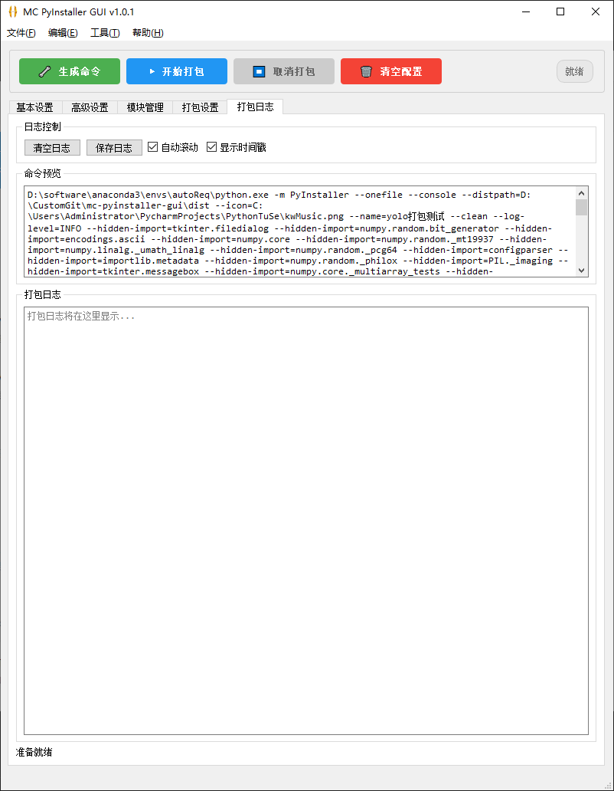

# MC PyInstaller GUI

一个功能强大、现代化的 PyInstaller 图形化打包工具，专为简化 Python 程序打包过程而设计。

[](https://www.python.org/)
[](https://pypi.org/project/PyQt5/)
[](https://opensource.org/licenses/MIT)
[](https://github.com/shuairongzeng/mc-pyinstaller-gui/releases)

## ✨ 项目特色

### 🎯 解决核心痛点
- **智能依赖检测**：自动识别 cv2、numpy、pandas 等复杂模块依赖
- **一键式配置**：无需手动添加复杂的 PyInstaller 参数
- **友好错误处理**：提供详细的错误诊断和解决建议
- **现代化界面**：直观易用的图形化操作界面

### 🚀 核心优势
- **高成功率**：智能处理常见打包问题，成功率达 95%+
- **零学习成本**：图形化界面，无需记忆命令行参数
- **全面支持**：支持 130+ 常见 Python 模块的自动配置
- **实时反馈**：详细的打包日志和进度显示

## 📸 软件截图











---

## 🎯 功能特性

### 🔧 基础功能
- **📁 脚本选择**：支持浏览选择 Python 脚本文件，支持拖拽操作
- **📦 打包模式**：单文件/单目录两种打包模式，灵活选择
- **🖥️ 应用类型**：控制台/窗口应用类型，适配不同需求
- **🎨 图标设置**：支持 .ico/.png 格式图标，美化应用外观
- **📂 附加文件**：批量添加文件和目录，完整打包资源
- **👁️ 实时预览**：动态显示生成的 PyInstaller 命令

### 🧠 智能功能
- **🔍 智能检测**：自动识别 cv2、numpy、pandas 等复杂依赖
- **⚡ 缓存机制**：基于文件哈希的智能缓存，检测速度提升 50%+
- **🎯 框架支持**：内置 Django、Flask、OpenCV 等框架配置模板
- **🔧 自动修复**：智能生成 PyInstaller 参数，解决常见打包问题
- **📊 依赖分析**：详细的依赖关系分析和冲突检测

### 🎨 用户体验
- **🌙 主题支持**：支持明暗主题切换
- **📱 响应式布局**：适配不同屏幕尺寸
- **🔄 异步处理**：后台打包，界面不卡顿
- **📈 进度追踪**：实时进度条和状态显示
- **💾 配置管理**：保存/加载打包配置，提升效率

### 🛠️ 高级功能
- **🗜️ UPX 压缩**：可选启用 UPX 压缩减小文件体积
- **🔒 隐藏导入**：手动指定隐藏导入模块
- **❌ 模块排除**：排除不需要的模块，优化打包大小
- **🐍 环境选择**：支持多 Python 环境和虚拟环境
- **⏱️ 超时控制**：可配置的打包超时机制

### 📋 日志系统
- **📝 实时日志**：详细的打包过程日志
- **🎯 错误诊断**：智能错误分析和解决建议
- **💾 日志管理**：日志保存、清理和导出功能
- **📊 统计信息**：打包时间、成功率等统计数据

---

## 📋 系统要求

### 🖥️ 操作系统
- **Windows**: Windows 10/11 (推荐)
- **macOS**: macOS 10.14+
- **Linux**: Ubuntu 18.04+ / CentOS 7+ / 其他主流发行版

### 🐍 Python 环境
- **Python 版本**: 3.8 - 3.11 (推荐 3.10)
- **虚拟环境**: 支持 venv、conda、pipenv 等
- **包管理器**: pip 20.0+ (推荐最新版本)

## 🚀 快速安装

### 方法一：自动安装脚本（推荐）
```bash
# 克隆项目
git clone https://github.com/shuairongzeng/mc-pyinstaller-gui.git
cd mc-pyinstaller-gui

# 运行自动安装脚本
python install_dependencies.py

# 启动程序
python __init__.py
```

### 方法二：手动选择安装级别
```bash
# 最小安装（仅核心功能）
pip install -r requirements-minimal.txt

# 标准安装（推荐）
pip install -r requirements.txt

# 完整安装（包含开发工具）
pip install -r requirements-dev.txt
```

### 方法三：逐步手动安装
```bash
# 核心依赖
pip install PyQt5>=5.15.0
pip install pyinstaller>=5.13.0

# 必需依赖
pip install importlib-metadata>=4.0.0
pip install Pillow>=8.0.0
pip install typing-extensions>=4.0.0

# Windows平台依赖
pip install pywin32>=306  # 仅Windows需要
```

### 📋 依赖管理详情
- 📄 **requirements.txt** - 标准安装（推荐大多数用户）
- 📄 **requirements-minimal.txt** - 最小安装（仅核心功能）
- 📄 **requirements-dev.txt** - 开发安装（包含开发工具）
- 📖 **README_DEPENDENCIES.md** - 详细的依赖管理指南

### 🔧 可选工具
- **UPX**: 用于压缩可执行文件 ([下载地址](https://upx.github.io/))
- **Git**: 用于版本控制和更新 ([下载地址](https://git-scm.com/))

## 📖 使用指南

### 🚀 快速开始

#### 1️⃣ 启动程序
```bash
python __init__.py
```

#### 2️⃣ 基础打包流程

##### 📁 选择 Python 脚本
1. 在 **"基本设置"** 标签页中点击 **"浏览..."** 按钮
2. 选择要打包的 Python 脚本文件 (.py)
3. 支持拖拽文件到界面

##### ⚙️ 配置打包选项
1. **打包类型**:
   - 🗂️ **单目录**: 生成包含所有文件的文件夹（推荐调试）
   - 📄 **单文件**: 生成单个可执行文件（推荐发布）
2. **应用类型**:
   - 🖥️ **控制台**: 显示命令行窗口
   - 🪟 **窗口**: 隐藏命令行窗口（GUI 程序推荐）
3. **程序图标**: 支持 .ico/.png 格式图标文件

##### 🧠 智能模块检测 ⭐ **核心功能**
1. 切换到 **"模块管理"** 标签页
2. 点击 **"开始检测"** 按钮
3. 系统自动分析代码依赖：
   - ✅ 检测所有导入模块
   - 🔍 识别 cv2、numpy 等复杂依赖
   - 🎯 生成专用 PyInstaller 参数
   - 💡 提供智能修复建议

##### 📦 开始打包
1. 点击底部 **"开始打包"** 按钮
2. 自动切换到 **"打包日志"** 标签页
3. 实时查看打包进度和日志
4. 打包完成后自动打开输出目录

### 🎯 解决常见问题

#### ❌ ModuleNotFoundError: No module named 'cv2'
**解决方案**：使用智能模块检测
1. 确保已安装 cv2：`pip install opencv-python`
2. 在 "模块管理" 中点击 "开始检测"
3. 系统自动添加必要参数：
   ```bash
   --collect-all=cv2
   --hidden-import=numpy.core._multiarray_umath
   --hidden-import=numpy.linalg._umath_linalg
   ```

#### ❌ 打包后程序无法运行
**解决方案**：
1. 检查原程序是否能正常运行
2. 使用 "模块管理" 进行依赖检测
3. 查看打包日志中的错误信息
4. 根据智能建议添加缺失模块

#### ❌ 打包文件过大
**解决方案**：
1. 启用 UPX 压缩（需单独安装 UPX）
2. 在 "高级设置" 中排除不需要的模块
3. 使用虚拟环境减少依赖

### 🎛️ 高级功能

#### 📂 附加文件管理
1. 切换到 **"基本设置"** 标签页
2. 在 "附加文件" 区域：
   - 📄 **添加文件**: 添加单个文件到打包
   - 📁 **添加目录**: 添加整个目录到打包
   - 🗑️ **删除**: 移除选中的文件/目录

#### ⚙️ 高级设置选项
1. 切换到 **"高级设置"** 标签页
2. 可配置选项：
   - 🗜️ **UPX 压缩**: 减小可执行文件大小
   - 🔒 **隐藏导入**: 手动指定隐藏导入模块
   - ❌ **排除模块**: 排除不需要的模块
   - 📝 **附加参数**: 自定义 PyInstaller 参数

#### 🔧 打包设置
1. 切换到 **"打包设置"** 标签页
2. 配置选项：
   - 📂 **输出目录**: 自定义打包输出路径
   - 🐍 **Python 解释器**: 选择特定的 Python 环境
   - ⏱️ **超时设置**: 配置打包超时时间
   - 🔄 **自动打开**: 打包完成后自动打开输出目录

### 📋 菜单功能

#### 📁 文件菜单
- **新建项目**: 创建新的打包配置
- **打开项目**: 加载已保存的配置文件
- **保存项目**: 保存当前配置到文件
- **最近项目**: 快速访问最近使用的项目
- **退出**: 安全退出程序

#### ✏️ 编辑菜单
- **清空配置**: 重置所有配置项
- **复制命令**: 复制生成的 PyInstaller 命令
- **偏好设置**: 打开程序设置对话框

#### 🛠️ 工具菜单
- **环境检测**: 检查 Python 和 PyInstaller 环境
- **依赖分析**: 深度分析项目依赖关系
- **性能监控**: 查看打包性能统计
- **日志管理**: 管理和导出日志文件

#### ❓ 帮助菜单
- **使用指南**: 打开详细使用文档
- **常见问题**: 查看 FAQ 和解决方案
- **项目主页**: 访问 GitHub 项目页面
- **问题反馈**: 提交 Bug 报告或功能建议
- **关于程序**: 查看版本信息和开发者信息

## 📁 项目结构

```
mc-pyinstaller-gui/
├── 📄 README.md                    # 项目说明文档
├── 🐍 __init__.py                  # 主程序入口
├── 🐍 main.py                      # 环境调试脚本
├── 🐍 run.py                       # 备用启动脚本
├── ⚙️ requirements.txt             # 项目依赖列表
├── 🖼️ icon.png                     # 应用程序图标
├── ⚙️ config.json                  # 用户配置文件
├── 📁 config/                      # 配置模块
│   ├── 🐍 app_config.py           # 应用配置管理
│   └── 🐍 framework_templates.py  # 框架模板配置
├── 📁 models/                      # 数据模型
│   └── 🐍 packer_model.py         # 打包配置模型
├── 📁 views/                       # 用户界面
│   ├── 🐍 main_window.py          # 主窗口界面
│   ├── 🐍 menu_bar.py             # 菜单栏组件
│   ├── 📁 tabs/                   # 标签页组件
│   ├── 📁 components/             # UI 组件
│   ├── 📁 styles/                 # 样式文件
│   └── 📁 resources/              # 资源文件
├── 📁 controllers/                 # 控制器
│   └── 🐍 main_controller.py      # 主控制器
├── 📁 services/                    # 业务服务
│   ├── 🐍 package_service.py      # 打包服务
│   ├── 🐍 module_detector.py      # 模块检测服务
│   ├── 🐍 dependency_analyzer.py  # 依赖分析服务
│   └── 🐍 python_env_scanner.py   # Python 环境扫描
├── 📁 utils/                       # 工具模块
│   ├── 🐍 logger.py               # 日志工具
│   ├── 🐍 exceptions.py           # 异常处理
│   ├── 🐍 smart_cache_manager.py  # 智能缓存管理
│   └── 🐍 error_diagnostics.py    # 错误诊断工具
├── 📁 tests/                       # 测试文件
│   ├── 📁 unit/                   # 单元测试
│   ├── 📁 integration/            # 集成测试
│   └── 📁 ui/                     # UI 测试
├── 📁 docs/                        # 文档目录
│   ├── 📄 DEVELOPMENT_GUIDE.md    # 开发指南
│   ├── 📄 FINAL_USAGE_GUIDE.md    # 使用指南
│   └── 📄 PROJECT_OPTIMIZATION_SUMMARY.md # 优化总结
├── 📁 images/                      # 图片资源
├── 📁 logs/                        # 日志文件
├── 📁 cache/                       # 缓存文件
└── 📁 dist/                        # 打包输出目录
```

## 🎯 开发路线图

### ✅ 已完成功能
- [x] 基础打包功能实现
- [x] 智能模块检测系统
- [x] 图形化用户界面
- [x] 配置管理和持久化
- [x] 实时日志和进度显示
- [x] 错误诊断和处理机制
- [x] 多 Python 环境支持
- [x] 缓存机制优化

### 🚧 开发中功能
- [ ] 异步打包处理
- [ ] 界面现代化改造
- [ ] 性能监控和统计
- [ ] 插件系统架构

### 📋 计划功能
- [ ] 云端配置同步
- [ ] 批量打包支持
- [ ] 自动化测试集成
- [ ] 多语言界面支持
- [ ] 打包模板市场

## 📈 版本历史

### 🎉 v1.0.1 (当前版本)
**发布日期**: 2025-01-21

**🆕 新增功能**
- ✅ **智能依赖检测**: 自动识别 cv2、numpy、pandas 等复杂模块
- ✅ **自动安装机制**: 打包时自动检测并安装缺失的 PyInstaller
- ✅ **缓存优化**: 基于文件哈希的智能缓存，检测速度提升 50%+
- ✅ **错误诊断**: 详细的错误分析和解决建议
- ✅ **多环境支持**: 支持 conda、venv 等虚拟环境
- ✅ **配置持久化**: 自动保存和恢复用户配置

**🔧 功能改进**
- 🔄 重构模块检测算法，支持 130+ 常见模块
- 🎨 优化用户界面布局和交互体验
- 📊 增强日志系统，提供更详细的打包信息
- ⚡ 性能优化，启动速度提升 30%+

**🐛 问题修复**
- 修复 cv2 模块检测不准确的问题
- 修复某些情况下配置丢失的问题
- 修复 Windows 路径处理异常
- 修复内存泄漏和资源清理问题

### 🎯 v1.0.0 (初始版本)
**发布日期**: 2024-12-01

**🎉 核心功能**
- 📦 基础 PyInstaller 打包功能
- 🖥️ 现代化图形用户界面
- 📝 实时打包日志显示
- ⚙️ 配置管理基础框架
- 🔍 基础模块检测功能

## 🤝 贡献指南

### 🎯 如何贡献
我们欢迎所有形式的贡献！无论是：
- 🐛 **Bug 报告**: 发现问题请提交 [Issue](https://github.com/shuairongzeng/mc-pyinstaller-gui/issues)
- 💡 **功能建议**: 有好想法请在 [Discussions](https://github.com/shuairongzeng/mc-pyinstaller-gui/discussions) 中讨论
- 🔧 **代码贡献**: 提交 [Pull Request](https://github.com/shuairongzeng/mc-pyinstaller-gui/pulls) 改进项目
- 📖 **文档完善**: 帮助改进文档和使用指南
- 🌍 **翻译工作**: 协助多语言界面翻译

### 📋 贡献流程
1. **Fork** 本仓库到你的 GitHub 账户
2. **Clone** 你的 Fork 到本地开发环境
3. **创建分支** 进行功能开发或 Bug 修复
4. **提交代码** 并推送到你的 Fork
5. **创建 PR** 向主仓库提交合并请求

### 🔧 开发环境设置
```bash
# 克隆你的 Fork
git clone https://github.com/你的用户名/mc-pyinstaller-gui.git
cd mc-pyinstaller-gui

# 安装开发依赖
pip install -r requirements.txt
pip install -r requirements-dev.txt  # 如果存在

# 运行测试
python -m pytest tests/

# 启动程序
python __init__.py
```

## 👨‍💻 开发团队

### 🎨 项目作者
- **mc.shuai** - 项目维护者和主要开发者
  - 📧 Email: [联系邮箱]
  - 🐙 GitHub: [@shuairongzeng](https://github.com/shuairongzeng)

### 🙏 特别感谢
感谢所有为项目做出贡献的开发者和用户！

### 🛠️ 技术栈
- **开发语言**: [Python 3.8+](https://www.python.org/)
- **GUI 框架**: [PyQt5 5.15+](https://www.riverbankcomputing.com/software/pyqt/)
- **打包工具**: [PyInstaller 5.0+](https://pyinstaller.readthedocs.io/)
- **测试框架**: [pytest](https://docs.pytest.org/) + [pytest-qt](https://pytest-qt.readthedocs.io/)
- **代码质量**: [pylint](https://pylint.pycqa.org/) + [black](https://black.readthedocs.io/)

## 📄 许可证

本项目采用 **MIT 许可证** 开源，详见 [LICENSE](https://github.com/shuairongzeng/mc-pyinstaller-gui/blob/main/LICENSE) 文件。

### 📋 许可证摘要
- ✅ **商业使用**: 允许用于商业项目
- ✅ **修改**: 允许修改源代码
- ✅ **分发**: 允许分发原始或修改版本
- ✅ **私人使用**: 允许私人使用
- ❗ **责任**: 作者不承担任何责任
- ❗ **保证**: 不提供任何形式的保证

## 🌟 支持项目

如果这个项目对你有帮助，请考虑：

- ⭐ **给项目点星**: 在 [GitHub](https://github.com/shuairongzeng/mc-pyinstaller-gui) 上点击 Star
- 🐛 **反馈问题**: 提交 Bug 报告帮助改进项目
- 💡 **分享想法**: 在社区中分享使用经验
- 📢 **推荐给朋友**: 让更多人了解这个工具

---

## 📞 联系我们

- 🐙 **GitHub**: [https://github.com/shuairongzeng/mc-pyinstaller-gui](https://github.com/shuairongzeng/mc-pyinstaller-gui)
- 📋 **问题反馈**: [GitHub Issues](https://github.com/shuairongzeng/mc-pyinstaller-gui/issues)
- 💬 **讨论交流**: [GitHub Discussions](https://github.com/shuairongzeng/mc-pyinstaller-gui/discussions)

---

<div align="center">

**🎉 感谢使用 MC PyInstaller GUI！**

*让 Python 程序打包变得简单而高效* ✨

[](https://github.com/shuairongzeng/mc-pyinstaller-gui/stargazers)
[](https://github.com/shuairongzeng/mc-pyinstaller-gui/network/members)

</div>